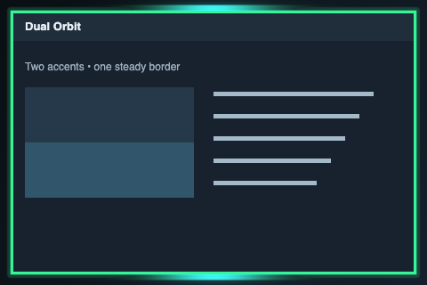

# Border effects

[Installation and configuration](../README.md#install)

| Preview | Effect | Description |
| --- | --- | --- |
|  | [accent-pulse](accent-pulse/) | A soft pulse travels around the focused border, tinted by the theme accent. |
|  | [beach-surf](beach-surf/) | Moving surf and foam around the focused window. |
|  | [cartoon-chase](cartoon-chase/) | A cartoon bird, a pursuing coyote, and a spinning devil race around the window. |
|  | [dual-orbit](dual-orbit/) | Two bright accent highlights circle opposite sides of a steady border. |
|  | [faerie-magic](faerie-magic/) | Iridescent threads, wand-light, and fairy dust around the focused window. |
|  | [flowering-vine](flowering-vine/) | Intertwined vines, opening flowers, and drifting blooms around the focused window. |
|  | [flowing-water](flowing-water/) | Circulating swells, curling crests, and airborne spray around the window. |
|  | [fuse](fuse/) | A braided fuse with travelling embers, ash, and sparks. |
|  | [lightning](lightning/) | Blue-white lightning and travelling crackle spots around the window. |
|  | [neon-bleed](neon-bleed/) | A compact rainbow wax band that drips inward from the window edge. |
|  | [paper](paper/) | Four pencils draw graphite around a paper-like window perimeter. |
|  | [pink-ribbon](pink-ribbon/) | A flowing satin-pink ribbon carrying small beating hearts. |
|  | [portal-lava](portal-lava/) | Violet and orchid pools with sparse magical filaments around the edge. |
|  | [pulse](pulse/) | A cyan border that gently brightens and fades. |
|  | [rainbow](rainbow/) | A glossy rainbow ripple around the window edge. |
|  | [sentient-runner](sentient-runner/) | Green-and-gold circuit tracks with branching links and moving packets. |
|  | [sentient-spark](sentient-spark/) | Independent emerald and white micro-discharges around the whole perimeter. |
